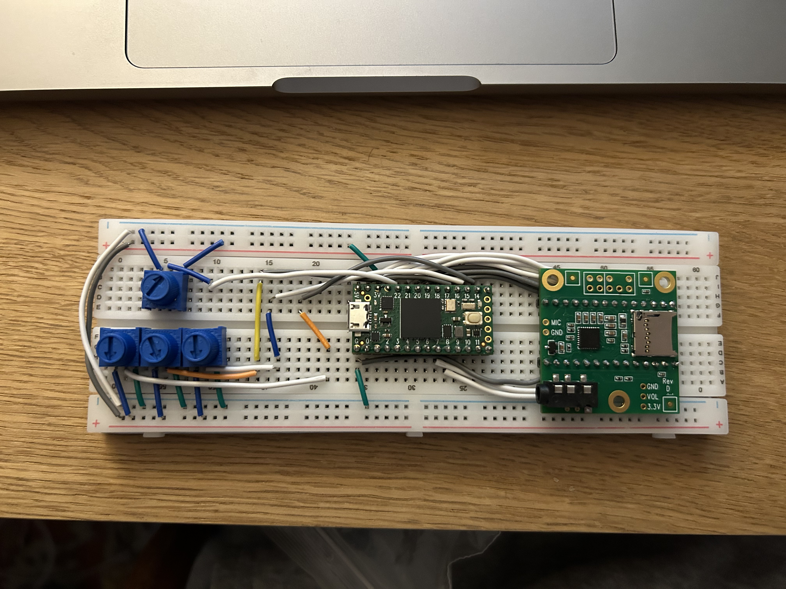
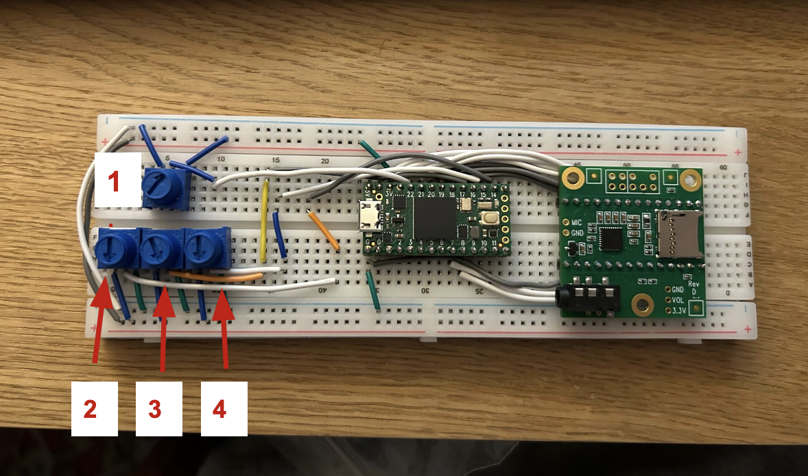

# Teensy Audio Illusions

#### Engine to demonstrate various auditory illusions using a teensy 4.0 microcontroller, its audio shield and some potentiometers. 

Written by Sam Miller and Greer Page for Dr. Barsic's CMPE 3815 - Microcontroller Systems at the University of Vermont. 

## Physical Setup

## Illusions 
### Binaural Beats
Two sine waves of almost identical frequencies are played simultaneously. The brain perceives a beating tone at the  frequency of the two waves' frequencies subtracted from eachother.

For example: 440 and 444Hz are played, brain hears a 4Hz beating tone, even though nothing is oscillating at that frequdncy.

### Missing Fundamental
Any tone apart from pure sine waves will have overtones. These overtones are harmonics of the fundamental tone, the lowes frequency and the tone perceived by the brain. Harmonics are simply just n multiples of the fundamental frequency. 

The illusion is that by using a high pass filter, the fundamental base frequency can be removed so that only the overtones are played. Despite its removal, the ear still hears the fundamental tone. 

### Shepard Tone
The Shepard tone is an endlessly rising pitch, think of a barber pole of sound. It is created by simultaneously raising the pitch of several sine waves all an octave part. This creates a spectrum of high, middle, and low tones. These tones are controlled so that each time the highest tone reaches a threshold, it is reset to the lowest tone. This means that each wave is trapped within specified octaves. The trick is that as each wave reaches either end of the spectrum, low or high, its gain is tapered so that its reset is not clearly heard to the user. This creates the illusion of an endlessly rising tone. 

## Functionality

#### Cycle through demonstrations of each illusion using  potentiometer 1. They are displayed in the order layed our below. 
Potentiometer 2 is used for master volume control of the device. Connect speakers or headphones to the headphone jack on the audio shield. 
### Binaural beats
Select a base frequency using pot 4. This is chosen from the frequencies of notes A2 to A4 of the western musical scale. Pot 3 allows users to set the beat frequency.
### Missing Fundamental
The fundamental frequency is set from the frequencies of notes A2 to A4 of the western musical scale using pot 4. As pot 3 is turned, the threshold frequency for filtering raises. The first fitler only filters the fundamental, as the pot turns, more and more harmonics are filtered. The illusion weakens with more harmonics filtered. 
### Shepard Tone
The speed of the rising pitch can be controlled with pot 4.

## Future directions
#### Add more illusions!
- Tritone paradox - two shepard tones a tritone (half octave) apart. Some people perceive the pitch as rising, some people perceive it as falling.
- Combination tones - Two high pitches combing to form a lower perceived pitch. 